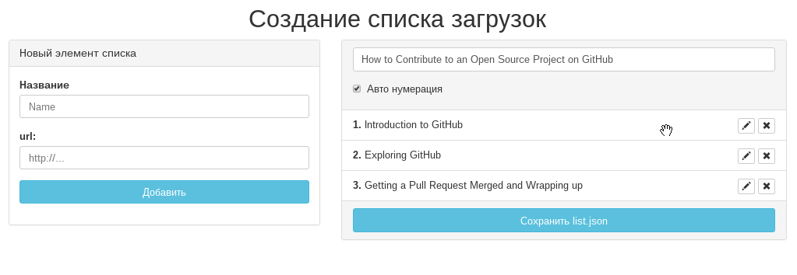

# node-download-list

Скрипт для скачивания списка файлов из интернета.

Для его работы необходим JSON файл `list.json` в котором будет массив со ссылками для скачивания и названия файлов и еще название папки куда это все будет качаться.


Пример этого файла выглядит вот так:
```json

{
    "name": "Название папки",
    "list": [{
            "url": "http://url/to/file",
            "title":"Название файла"
        }]
}
```

В консоли выполняем следующее:
```
git clone https://github.com/avil13/node-download-list
cd node-download-list
npm install
```
### В версии 1.2 добавлен web интерфейс для создания файла `list.json`



Для запуска страницы создания списка загрузок в консоли выполните:
```
npm run server
```
И откройте указанную в консоли страницу.
На ней вы сможете заполнить файл `list.json` и сохранить его.


После закидываем свой файл `list.json` вместо того, который здесь для примера и начинаем скачивать при помощи команды:

```
node index.js
```
В ходе выполнения будет показываться прогрессбар со статусом загрузки:
```
$ node index.js
Total size: ~ 175 Mb
 Downloading [░░░                           ] 9% 848.7s
```
Размеры вычисляются не точно.

Все сохраняется в папку `download`
